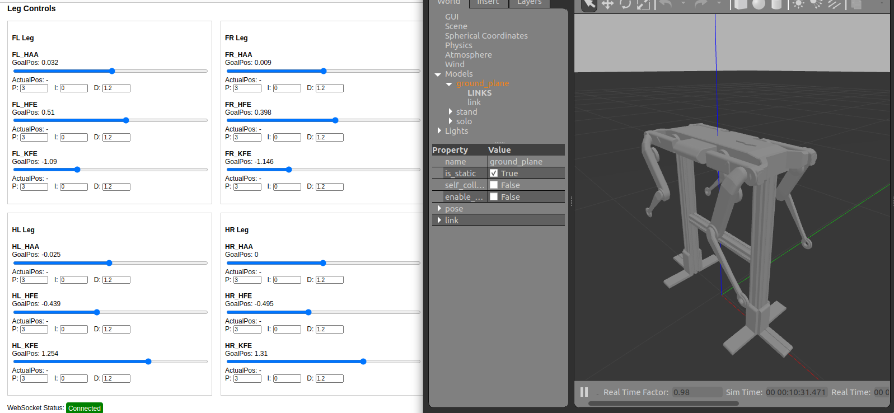

Gazebo Transport package is used to to communicate with gazebo model plugin and control joint position using Web Interface.
Script is used to replace mesh reference paths, removing dependency over ROS.
hardware_interface has inherited master-board functions to communicate with robot as per the example files.
Further features have to be added in both and testing with hardware is not done.



# solo12_robot

Base code for Nala robot (SOLO12 robot from Open Dynamic Robot Initiative)


## Installation (Standalone)

> This installation do not requerire ROS

from the `ROOT` folder of this repo:

```
bash script/install.sh
```


## Starting Gazebo Simulation
```
bash script/launch.sh
```
'''
To run it requires custom change of base directories and replacing the solol12.sdf file at model folder and control plugin location.
All those are done using python script.
'''

##  Start NodeJS server for Web GUI communication and start webpage to send joint commands.
$SOLO12_ROBOT_DIR/solo12_control/control_interface/build/websocket_to_cpp.js
$SOLO12_ROBOT_DIR/solo12_control/control_interface/websocket-server/solo12_control_panel.html
